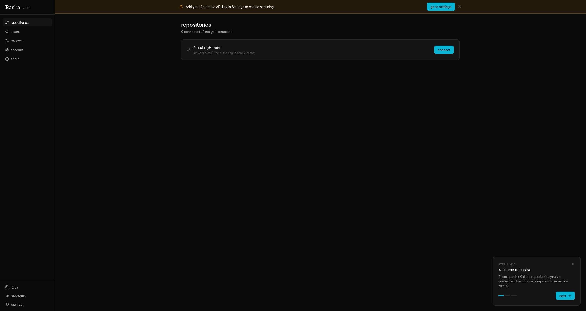
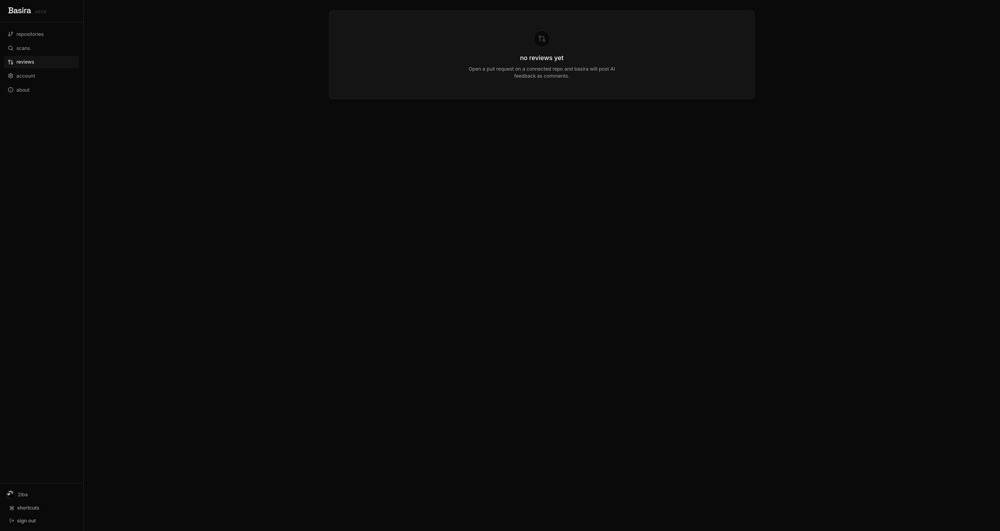
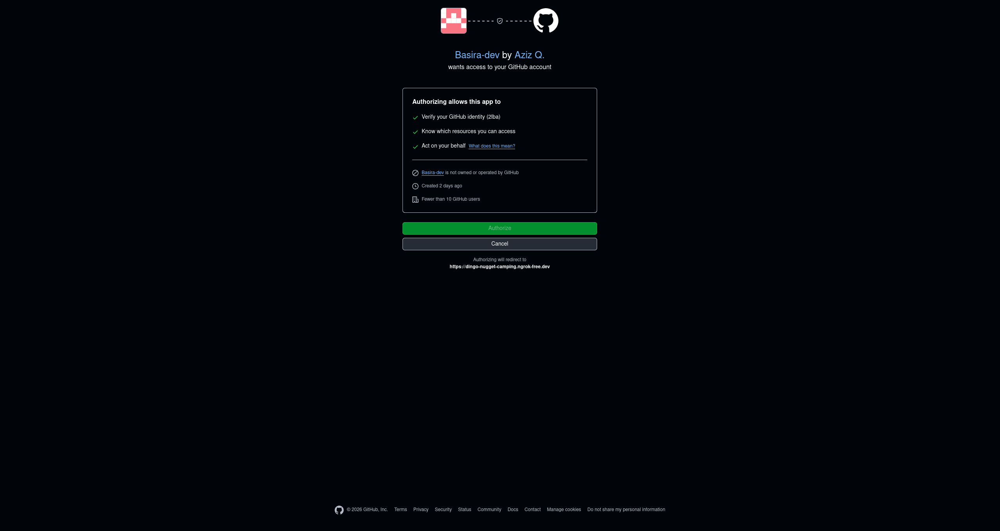
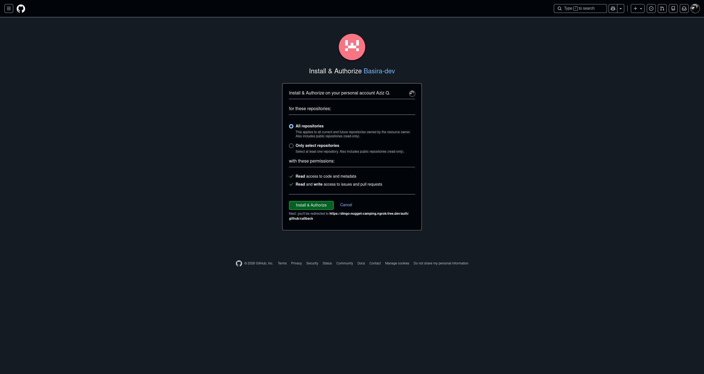
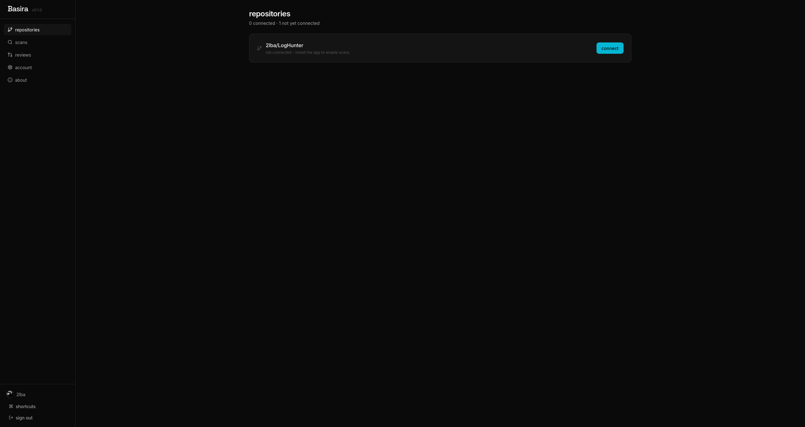
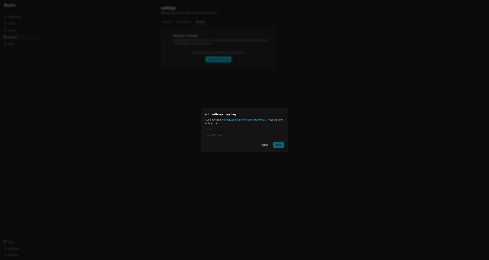
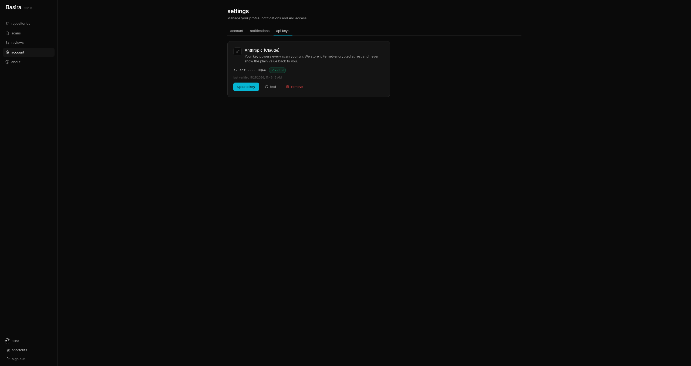
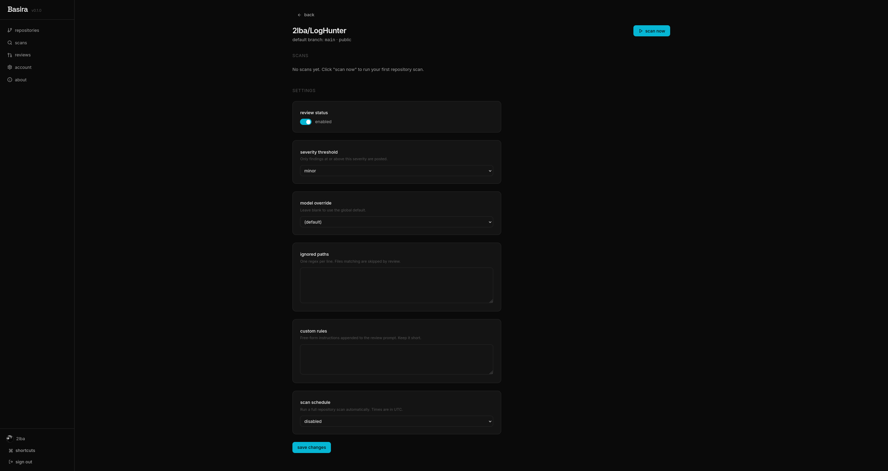
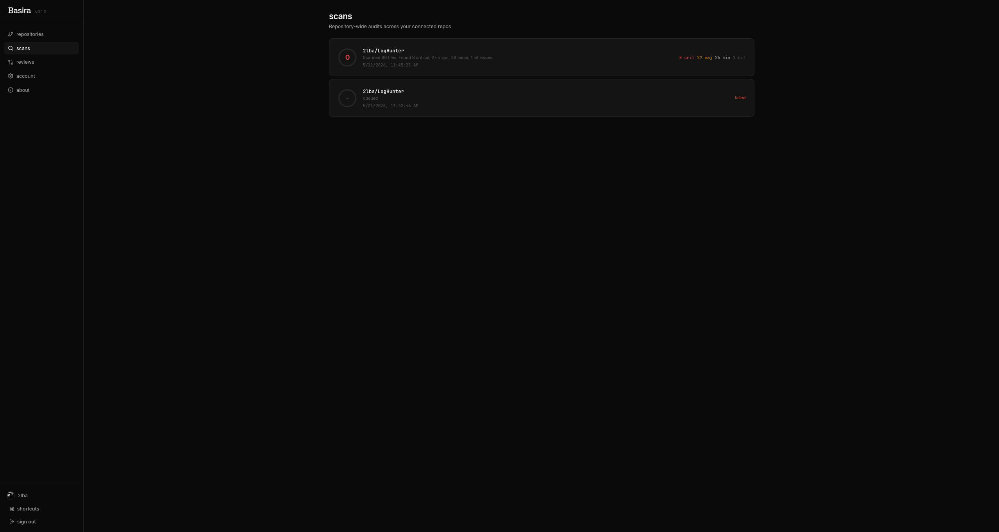
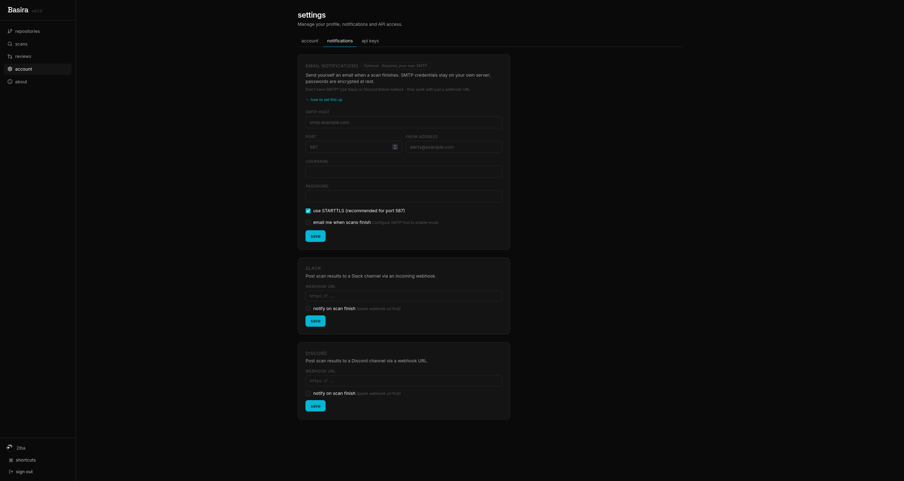

# Basira

AI code reviewer for your GitHub repositories. Self-hosted, BYOK, open source.



Basira scans a repo on demand and posts findings with severity, file location, and reasoning. You bring your own Anthropic API key, so there is no shared infrastructure cost and your code never touches a third party server other than Anthropic's.

## Why I built this

CodeRabbit and similar tools are good but closed and paid. I wanted something I could read the prompts of, run on my own box, and point at any repo without a per-seat fee. So I built Basira.

It is honest about its limits. Below is a scan of one of my own projects, LogHunter v0.1.0. Score is zero. Sixty-two findings. I left the screenshot in instead of replacing it with a cleaner repo, because that is how Basira behaves on a real codebase that has not been hardened yet.



## What it does

- Scan any connected GitHub repo on demand
- Group findings by severity (critical, major, minor, nit)
- Filter findings, resolve them, mark as false positive
- Compare two scans to see what changed
- Export results as markdown
- Share a scan via public link
- Notify on Slack, Discord, or email when a scan finishes
- Schedule daily, weekly, or monthly scans
- BYOK: bring your own Anthropic API key

## Tech

Python 3.13, FastAPI, PostgreSQL 16, Redis 7, React 18, Vite, Tailwind, Playwright, Docker Compose.

## Quick start

```
git clone https://github.com/2lba/basira.git
cd basira
cp .env.example .env
```

Fill in `.env`:

- `GITHUB_APP_ID`, `GITHUB_APP_CLIENT_ID`, `GITHUB_APP_CLIENT_SECRET`, `GITHUB_APP_WEBHOOK_SECRET` from your GitHub App
- `FERNET_KEY` for at-rest encryption (`python -c "from cryptography.fernet import Fernet; print(Fernet.generate_key().decode())"`)
- `JWT_SECRET` (long random string)

Place your GitHub App private key at `secrets/github-app-key.pem` with `chmod 600`.

Then:

```
docker compose up -d
```

Open http://localhost:5173 and continue with GitHub.


## Setup walkthrough

### 1. Create the GitHub App

Go to https://github.com/settings/apps/new and configure:

- **Callback URL**: `https://your-domain.com/auth/github/callback`
- **Webhook URL**: `https://your-domain.com/webhooks/github`
- **Permissions**: Contents (read), Issues (read & write), Pull requests (read & write), Email addresses (read)
- **Events**: Push, Pull request

Save the App ID, Client ID, Client Secret, Webhook Secret, and download the private key.

### 2. Sign in with GitHub



### 3. Install Basira on your repos



### 4. Connect a repo



### 5. Add your Anthropic API key

Get a key from https://console.anthropic.com/settings/keys and paste it into Settings → API Keys. Basira encrypts it at rest with Fernet and uses it for all your scans. Nothing is shared with other users.




### 6. Configure and scan

Open the repo, adjust severity threshold or ignored paths if you want, then click "scan now".




A typical scan runs in 3 to 6 minutes and costs around $0.40 against your Anthropic account.

## BYOK economics

Each scan calls Claude Sonnet directly from the Basira backend, billed to your key. There is no per-seat fee, no markup, no quota imposed by Basira.

## Notifications

Send scan results to Slack, Discord, or email. SMTP credentials and webhook URLs stay on your server, encrypted at rest.




## Security

- All secrets encrypted at rest with Fernet
- JWT auth with rate limiting on login
- Webhook signature verification (HMAC-SHA256)
- SSRF prevention on webhook URLs (rejects private and metadata addresses)
- IDOR tests in CI
- Production mode refuses to boot with default secrets

See [SECURITY.md](SECURITY.md) for the threat model and the OWASP Top 10 audit results, and [docs/security/](docs/security/) for the full reports.

## What it does not do

- Run in CI as a blocking check (yet)
- Review individual pull requests inline (PR comments are on the roadmap)
- Scan private repos without a GitHub App installation
- Replace a human reviewer

## Roadmap

- PR-level reviews (inline comments)
- Custom rule packs
- Self-host one-click on Railway and Render
- Local model support (Ollama)

## Contributing

PRs welcome. Read [CONTRIBUTING.md](CONTRIBUTING.md) first.

## License

MIT. See [LICENSE](LICENSE).

## Author

Built by Abdulaziz AlQahtani ([@2lba](https://github.com/2lba)). Mechanical engineering student in Saudi Arabia, building security and developer tools on the side.

If Basira is useful to you, [support on Ko-fi](https://ko-fi.com/2lbaa).
